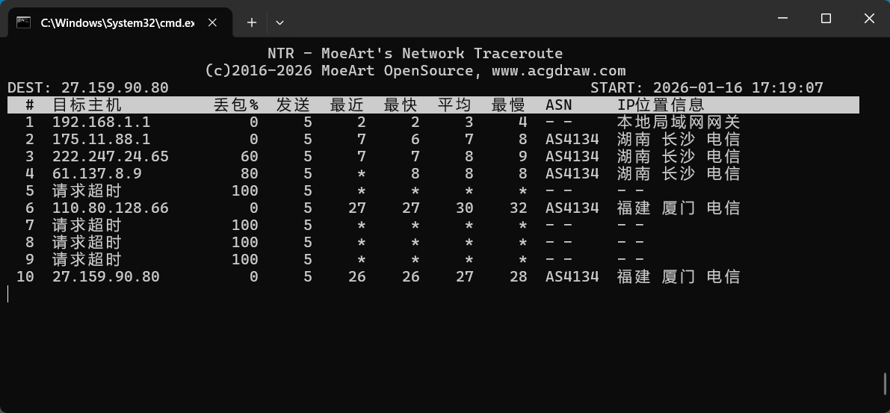
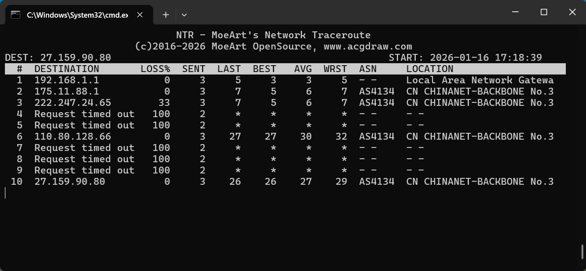

# NTR (MoeArt's Network TraceRoute)

[English Version](README.md)

## 项目背景
NTR 是一款网络诊断工具，最初使用 C# 开发。为了实现跨平台兼容性，我们使用 Go 语言对其进行了重写。本版本基于开源的 [mtr](https://github.com/tonobo/mtr) 项目开发，完全复刻了原始 C# 版本的功能，并在此基础上添加了新特性。原始的 C# 版本位于 `dotnet` 分支，现已不再更新。

NTR 是一款功能强大的网络诊断工具，专为网络工程师排查网络连接问题而设计。它可以通过 ICMP 协议识别源主机和目标主机之间的所有路由器，通过 IPtoASN 公共服务解析每个路由器的 BGP AS 编号，并使用 QQWry 数据库确定每个 IP 的地理位置。

# 功能特性

## 核心功能
* **跨平台支持**：可在 Windows、Linux 和 macOS 操作系统上无缝运行
* **基于 Go 实现**：使用 Go 1.25+ 构建，具有更好的性能和可靠性
* **ICMP 路由跟踪**：使用 ICMP 协议发现网络路径上的路由器
* **BGP ASN 解析**：将 IP 地址转换为 BGP AS 编号，以识别网络提供商
* **GeoIP 查询**：以中文和英文确定 IP 地址的地理位置

## 用户体验
* **美观的控制台输出**：功能完善、色彩丰富的界面，易于阅读
* **多语言支持**：提供中文和英文两种语言
* **IPv4/IPv6 支持**：适用于 IPv4 和 IPv6 地址，可选择强制使用特定协议

## 自定义配置
* **可配置的设置**：可调整超时和间隔参数，以适应不同的网络条件
* **自定义套接字绑定**：能够将输出套接字绑定到特定的网络接口

## 数据库管理
* **自动更新功能**：自动更新 ASN 和 GeoIP 数据库，确保信息准确
* **离线支持**：可使用本地 GeoIP 数据库（QQWry）进行离线中文 IP 位置查询

# 下载
您可以从 [Releases](https://github.com/moeart/ntr/releases/latest) 页面下载预构建的二进制文件。

# 截图

## 中文界面


## 英文界面


# 快速开始

### 最简单的使用方式
```bash
ntr www.acgdraw.com
```

### 禁用 BGP ASN 查询
```bash
ntr www.acgdraw.com -a
```

### 禁用 GeoIP 查询
```bash
ntr www.acgdraw.com -g
```

### 使用英文界面
```bash
ntr www.acgdraw.com -L en
```

### 强制使用 IPv4 协议
```bash
ntr www.acgdraw.com -4
```

### 更新 ASN 数据库
```bash
ntr -U
```

### 更新 GeoIP 数据库
```bash
ntr -G
```

### 其他选项
```
NTR - MoeArt's Network Traceroute
(c)2016-2026 MoeArt OpenSource, www.acgdraw.com

Usage:
  ntr TARGET [flags]

Flags:
  -s, --address string      The address to bind the outgoing socket to
  -a, --disable-asn         Disable IP to BGP AS number query.
  -g, --disable-geoip       Disable IP to geographic location query.
  -h, --help                help for ntr
  -i, --interval duration   Seconds between each traceroute. (min:1) (default 200ms)
  -4, --ipv4                Force using IPv4 protocol
  -6, --ipv6                Force using IPv6 protocol
  -L, --lang string         Set language (zh for Chinese, en for English) (default "zh")
  -m, --max-hop int         Maximum number of hops to try. (min:1, max:255) (default 25)
  -t, --timeout duration    Stop waiting for router response in seconds. (min:1) (default 1s)
  -U, --update-asn          Update ASN database from online source.
  -G, --update-geoip        Update GeoIP database from online source.
  -v, --version             Print version information
```

# 安装

## 前提条件
- Go 1.25+（用于从源代码构建）
- Git（用于克隆仓库）
- 管理员/root 权限（需要原始套接字访问权限）

## 从源代码构建

### Linux/macOS
```bash
# 克隆仓库
git clone https://github.com/moeart/ntr.git
cd ntr

# 构建应用
go build -o ntr main.go

# 使二进制文件可执行
chmod +x ntr

# 移动到 PATH 目录中（可选）
sudo mv ntr /usr/local/bin/
```

### Windows
```powershell
# 克隆仓库
git clone https://github.com/moeart/ntr.git
cd ntr

# 使用提供的脚本构建
./build.ps1

# 或手动构建
go build -o ntr.exe main.go
```

## 从预构建的二进制文件安装

您可以从 [Releases](https://github.com/moeart/ntr/releases/latest) 页面下载适用于您平台的预构建二进制文件。

### Linux
```bash
# 下载二进制文件
wget https://github.com/moeart/ntr/releases/latest/download/ntr-linux-amd64

# 使其可执行
chmod +x ntr-linux-amd64

# 移动到 PATH 目录中
mv ntr-linux-amd64 /usr/local/bin/ntr
```

### macOS
```bash
# 下载二进制文件
wget https://github.com/moeart/ntr/releases/latest/download/ntr-darwin-amd64

# 使其可执行
chmod +x ntr-darwin-amd64

# 移动到 PATH 目录中
mv ntr-darwin-amd64 /usr/local/bin/ntr
```

### Windows
1. 从 [Releases](https://github.com/moeart/ntr/releases/latest) 页面下载二进制文件
2. 解压 ZIP 文件
3. 运行 `ntr.exe` 可执行文件
4. （可选）将目录添加到 PATH 环境变量中

# 示例输出

```
NTR - MoeArt's Network Traceroute
(c)2016-2026 MoeArt OpenSource, www.acgdraw.com
DEST: 27.159.90.80        START: 2026-01-16 17:19:07

# 目标主机       丢包% 发送 最近 最快 平均 最慢 ASN    IP位置信息
1 192.168.1.1    0     5     2    2    3    4   --   本地局域网网关
2 175.11.88.1    0     5     7    6    7    8   AS4134 湖南 长沙 电信
3 222.247.24.65  60    5     7    7    8    9   AS4134 湖南 长沙 电信
4 61.137.8.9     80    5     *    8    8    8   --   --
5 请求超时       100   5     *    *    *    *   --   --
6 110.80.128.66  0     5     27   27   30   32  AS4134 福建 厦门 电信
7 请求超时       100   5     *    *    *    *   --   --
8 请求超时       100   5     *    *    *    *   --   --
9 请求超时       100   5     *    *    *    *   --   --
10 27.159.90.80  0     5     26   26   27   28  AS4134 福建 厦门 电信
```

# 许可证

本项目采用 [MIT License](https://github.com/moeart/ntr/blob/master/LICENSE) 开源许可证。

本项目基于 [https://github.com/tonobo/mtr](https://github.com/tonobo/mtr) 开发，该项目同样采用 MIT License 许可证。

## 依赖及其许可证

### 直接依赖
- [github.com/buger/goterm](https://github.com/buger/goterm) - MIT License
- [github.com/hokaccha/go-prettyjson](https://github.com/hokaccha/go-prettyjson) - MIT License
- [github.com/spf13/cobra](https://github.com/spf13/cobra) - Apache License 2.0
- [github.com/xiaoqidun/qqwry](https://github.com/xiaoqidun/qqwry) - MIT License
- [golang.org/x/net](https://github.com/golang/net) - BSD 3-Clause License

### 间接依赖
- [github.com/fatih/color](https://github.com/fatih/color) - MIT License
- [github.com/inconshreveable/mousetrap](https://github.com/inconshreveable/mousetrap) - Apache License 2.0
- [github.com/ipipdotnet/ipdb-go](https://github.com/ipipdotnet/ipdb-go) - MIT License
- [github.com/mattn/go-colorable](https://github.com/mattn/go-colorable) - MIT License
- [github.com/mattn/go-isatty](https://github.com/mattn/go-isatty) - MIT License
- [github.com/spf13/pflag](https://github.com/spf13/pflag) - BSD 3-Clause License
- [golang.org/x/sys](https://github.com/golang/sys) - BSD 3-Clause License
- [golang.org/x/text](https://github.com/golang/text) - BSD 3-Clause License
- [gopkg.in/yaml.v3](https://github.com/go-yaml/yaml) - MIT License

## 附加许可证
- IP 地理位置数据库使用 [QQWry](https://github.com/xiaoqidun/qqwry) 数据库进行离线中文 IP 位置查询。
- IP 转 ASN 使用由 [IPtoASN.com](https://iptoasn.com/) 提供的公共服务，该服务采用 [BSD 2-Clause License](https://github.com/jedisct1/iptoasn-webservice/blob/master/LICENSE) 许可证。它提供公共转换服务和离线数据库。

### MoeArt 开发团队
Github: https://github.com/moeart    
开发者主页: http://lab.acgdraw.com    
官方网站: http://www.acgdraw.com    
